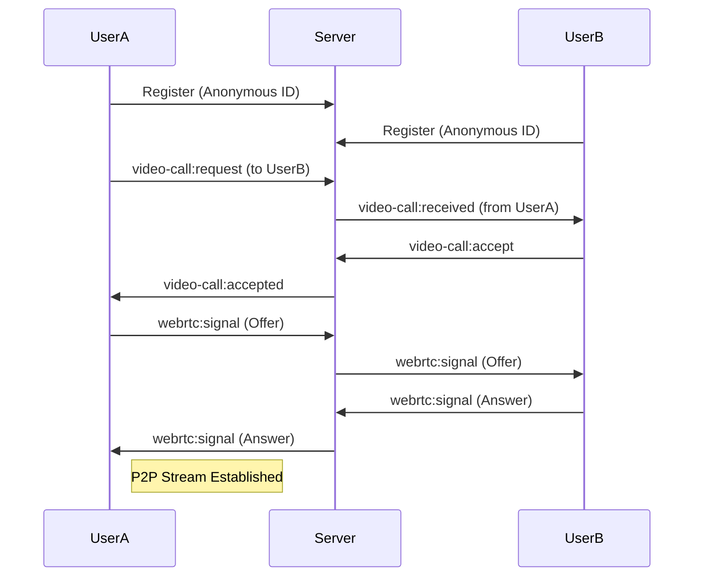

# FreeTalk: Real-Time Anonymous Mental Health Support

**FreeTalk** is a privacy-first, real-time communication platform designed to provide a safe space for individuals to share, connect, and seek support anonymously. In an age where digital footprints are permanent, FreeTalk offers a haven for vulnerability without the fear of judgment or tracking.

---

## 🚀 Portfolio Summary
**FreeTalk** is a full-stack web application built with **Next.js 13+, Node.js, Socket.io, and WebRTC**. It features a modular architecture, real-time messaging, and peer-to-peer video calling. The project demonstrates advanced proficiency in handling asynchronous state, real-time signaling, and responsive UI design, all while adhering to a "Privacy-by-Design" philosophy.

---

## 👁️ Project Vision & Problem Statement
### The Challenge
Mental health awareness is at an all-time high, yet many individuals hesitate to seek help or share their experiences due to social stigma, fear of data leaks, or the intimidating nature of formal therapy.

### Our Vision
FreeTalk exists to bridge the gap between isolation and connection. Our mission is to democratize mental health support by providing an **anonymous, barrier-free entry point** to conversation. By removing the requirement for personal identifiers, we empower users to speak their truth freely and find immediate peer support.

---

## 🔄 User Flow
1. **Discovery**: Users land on a soothing, dark-themed homepage and browse categorized chat rooms (e.g., *Stress & Anxiety*, *Career Talk*, *Random Support*).
2. **Anonymous Entry**: A user selects a room and chooses a temporary display name. No email or password is required for immediate entry.
3. **Engage**: Users join the real-time chat room where they can exchange messages instantly with other anonymous participants.
4. **Deep Connect**: If a user needs more personal support, they can initiate an encrypted, peer-to-peer video call with another participant within the room.
5. **Session End**: Users can hang up or leave the room at any time. Temporary session data is managed locally to ensure a clean exit.

---

## 👤 Anonymous Identity Design
FreeTalk prioritizes user anonymity through a multi-layered approach:
- **Zero-Req Registration**: Users can use the platform as "Guests" immediately.
- **LocalStorage Persistence**: Anonymous identities (usernames/temporary IDs) are stored in the user's browser, allowing for session continuity without server-side PII tracking.
- **Ephemeral Sessions**: Database records for anonymous users are marked with an `isAnonymous` flag, allowing for periodic cleanup and minimal data retention.

---

## ⚡ Real-Time Architecture
The platform utilizes a hybrid real-time architecture to balance performance and privacy.

### 1. Messaging & Signaling (Socket.io)
- **Pub/Sub Pattern**: Used for broadcasting chat messages and live participant counts to specific rooms.
- **WebRTC Signaling**: Socket.io acts as the intermediary (signaling server) to exchange SDP (Session Description Protocol) offers, answers, and ICE candidates between peers.

### 2. Peer-to-Peer Video (WebRTC)
- **Direct Connection**: Once the signaling handshake is complete, media streams (audio/video) flow directly between browsers.
- **STUN Servers**: Utilized to bypass NAT/Firewalls and establish direct P2P paths.



---

## 🛡️ Safety & Security Considerations
- **Privacy by Default**: No tracking cookies or invasive analytics.
- **Media Privacy**: WebRTC connections are encrypted via STUN/DTLS, ensuring media content never passes through our servers.
- **CORS & Security Headers**: The API is protected with strict CORS policies and environment-based configuration.
- **Moderation Hooks**: The architecture is designed to support future AI-driven sentiment analysis and automated moderation to filter harmful content in real-time.

---

## 🚧 Limitations & Future Enhancements
### Current Limitations
- **Mesh Topology**: Our current WebRTC implementation uses a Mesh network, which is highly efficient for 1-on-1 calls but can be resource-intensive for large group video sessions.

### The Roadmap
- **SFU Integration**: Transitioning to a Selective Forwarding Unit (SFU) for group video calls to improve scalability.
- **AI Moderation**: Implementing real-time text analysis to flag potential self-harm or harassment.
- **PWA Support**: Converting FreeTalk into a Progressive Web App for a more native mobile experience and offline support.
- **End-to-End Encrypted Chat**: Upgrading standard Socket.io messages to E2EE.

---

## 🛠️ Setup & Installation
### Prerequisites
- Node.js (v16+)
- MongoDB (Local or Atlas)

### 1. Clone & Install
```bash
git clone https://github.com/your-repo/freetalk.git
cd freetalk
```

### 2. Back-end Setup
```bash
cd back-end
npm install
# Configure your .env (MONGO_URI, PORT)
npm run dev
```

### 3. Front-end Setup
```bash
cd front-end
npm install
npm run dev
```
Open [http://localhost:3000](http://localhost:3000) to start talking.
